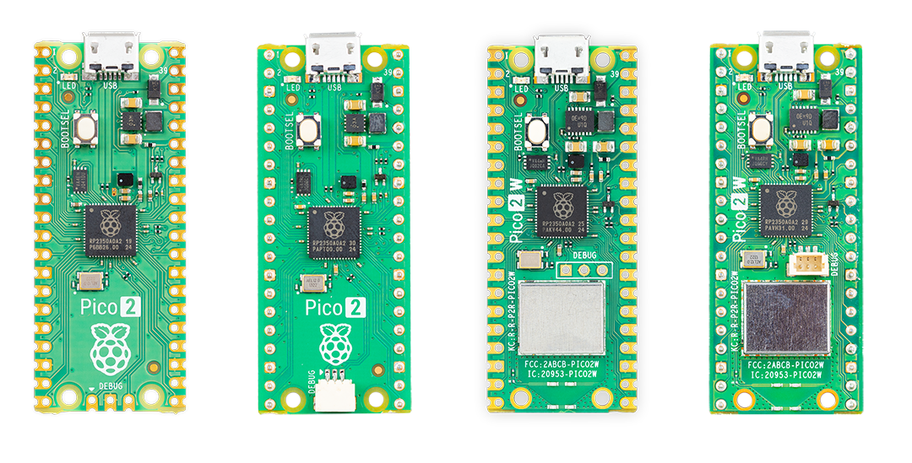

Raspberry Pi Pico is a development board that uses Raspberry Pi xref:../microcontrollers/microcontroller-chips.adoc[microcontrollers] (*RP2040* or *RP2350*). A Raspberry Pi Pico is programmed using *MicroPython*, *C*, or *{cpp}* and, unlike other Raspberry Pi devices, doesn't run Linux or support removable storage. Instead, Raspberry Pi Pico is programmed by flashing binaries to the on-board flash memory.

There are two generations of the Raspberry Pi Pico series:

* <<pico1>> (Pico 1)
* <<pico2>>

Each generation is available in four variants, which differ based on:

* *Wireless connectivity.* Variants that include the *W* suffix in the name include Wi-Fi and Bluetooth.
* *Presoldered headers.* Variants are available either as castellated modules (for direct soldering) or with presoldered pin headers.

[[pico1]]
== Raspberry Pi Pico

The first generation of Raspberry Pi Pico is based on the xref:../microcontrollers/microcontroller-chips.adoc#rp2040[RP2040] microcontroller chip. It comes in four variants, listed in <<variants, Table 1>>. For more detail about the variants, see <<non-wireless_pico>> (Raspberry Pi *Pico* and *Pico H*) and <<wireless_pico>> (Raspberry Pi *Pico W* and Pico *WH*).

[[variants]]
.Raspberry Pi Pico variants
[cols="2,1,1", options="header"]
|===
| |Wireless | Headers

|Raspberry Pi *Pico*
|No
|No

|Raspberry Pi *Pico H*
|No
|Yes (presoldered)

|Raspberry Pi *Pico W*
|Yes (Wi-Fi and Bluetooth)
|No

|Raspberry Pi *Pico WH*
|Yes (Wi-Fi and Bluetooth)
|Yes (presoldered)

|===

<<pico1-image, Figure 1>> provides a visual reference for the four Raspberry Pi Pico variants as seen from the top. Visually, these variants differ most obviously based on:

* The presence or absence of a wireless component.
* The presence or absence of presoldered header pins.
* The location and type of Serial Wire Debug (SWD) interface.

For more information about these differences, see <<non-wireless_pico>> and <<wireless_pico>>.

[[pico1-image]]
.The four Raspberry Pi Pico variants; from left to right: Raspberry Pi *Pico*, Raspberry Pi *Pico H*, Raspberry Pi *Pico W*, and Raspberry Pi *Pico WH*
image::images/pico-1s.png[width="75%"]

[[non-wireless_pico]]
=== Non-wireless Raspberry Pi Pico boards

Raspberry Pi *Pico* and *Pico H* are first-generation, non-wireless microcontroller boards based on the RP2040 chip. Both boards offer identical hardware capabilities, with the only physical differences being the presence of presoldered header pins on Raspberry Pi Pico H, and the style of the debug connector at the bottom of the boards. For more information, see <<swd>>.

The pinout and board layout for Raspberry Pi Pico and Pico H is the same as for Raspberry Pi *Pico 2* and *Pico 2 with headers*. For more information, see <<layout_non-wireless>>.

==== Key features

Raspberry Pi *Pico* and *Pico H* offer the following key features:

* *RP2040 microcontroller chip*, including:
  ** Dual-core M0+ processor.
  ** Flexible clock running up to 133 MHz.
  ** 264 kB of SRAM.
  ** USB 1.1 controller and PHY with device and host support.
  ** Low-power sleep and dormant modes.
  ** Accurate clock and timer.
  ** Accelerated floating-point libraries.
  ** Temperature sensor.
  ** Eight Programmable I/O (PIO) state machines for custom peripheral support.
    *** Flexible, user-programmable high-speed I/O.
    *** Can emulate interfaces such as SD card and VGA.

* *Board features*:
  ** Drag-and-drop programming using mass storage over USB.
  ** 2 MB of on-board flash memory.
  ** 26 multi-function GPIO pins. For more information, see <<layout_non-wireless>>.
  ** Debug connector. For more information, see <<swd>>.

* *Peripheral interfaces*:
  ** Two SPI
  ** Two I2C
  ** Two UART
  ** Three 12-bit ADC
  ** 16 PWM channels

==== Resources

Raspberry Pi offers additional technical documentation relevant to Raspberry Pi Pico and Pico H:

* https://pip.raspberrypi.com/documents/RP-008371-DS[RP2040 Datasheet: A microcontroller by Raspberry Pi]
* https://pip.raspberrypi.com/documents/RP-008307-DS[Raspberry Pi Pico Datasheet: An RP2040-based microcontroller board]
* https://pip.raspberrypi.com/documents/RP-008279-DS[Hardware design with RP2040: Using RP2040 microcontrollers to build boards and products]
* https://datasheets.raspberrypi.com/pico/getting-started-with-pico.pdf[Getting started with Raspberry Pi Pico-series microcontrollers: C/{cpp} development with Raspberry Pi Pico-series and other Raspberry Pi microcontroller-based boards]

Additionally, Raspberry Pi provides the following supporting hardware design resources:

* https://datasheets.raspberrypi.com/pico/RPi-Pico-R3-PUBLIC-20200119.zip[Design files] (Cadence Allegro): PCB design files for studying or reproducing the board layout.
* https://datasheets.raspberrypi.com/pico/Pico-R3-step.zip[STEP file]: a 3-dimensional CAD model of the board for enclosure and mechanical design.
* http://fritizing.org[Fritzing] parts: components for use in Fritzing, an electronics design tool for layouts and schematics:
    ** https://datasheets.raspberrypi.com/pico/Pico-R3-Fritzing.fzpz[Fritzing part for Raspberry Pi Pico]
    ** https://datasheets.raspberrypi.com/pico/PicoH-Fritzing.fzpz[Fritzing part for Raspberry Pi Pico H]

IMPORTANT: Design files for Raspberry Pi Pico and Pico H are openly available with no limitations. Raspberry Pi grants permission to use, copy, modify, and distribute the following designs for any purpose, with or without fee. Designs are provided 'as-is' and the author disclaims all warranties with regard to the design, including all implied warranties of merchantability and fitness. In no event shall the author be liable for any special, direct, indirect, or consequential damages or any damages whatsoever resulting from loss of use, data, or profits, whether in an action of contract, negligence, or other tortious action, arising out of or in connection with the use or performance of the design.

[[wireless_pico]]
=== Wireless Raspberry Pi Pico boards

Raspberry Pi *Pico W* and *Pico WH* are first-generation, wireless microcontroller boards based on the RP2040 chip. Both boards offer identical hardware capabilities, with the only physical differences being the presence of presoldered header pins on Raspberry Pi Pico WH, and the style of the debug connector below the microcontroller. For more information, see <<swd>>.

The pinout and board layout for Raspberry Pi Pico W and Pico WH is the same as for Raspberry Pi *Pico 2 W* and *Pico 2 W with headers*. For more information, see <<layout_wireless>>.

==== Key features

Raspberry Pi *Pico W* and *Pico WH* offer the same key features as Raspberry Pi *Pico* and *Pico H*, but with added wireless functionality. Specifically, Raspberry Pi Pico W and Pico WH offer the following key features:

* *RP2040 microcontroller chip*, including:
  ** Dual-core M0+ processor.
  ** Flexible clock running up to 133 MHz.
  ** 264 kB of SRAM.
  ** USB 1.1 controller and PHY with device and host support.
  ** Low-power sleep and dormant modes.
  ** Accurate clock and timer.
  ** Accelerated floating-point libraries.
  ** Temperature sensor.
  ** Eight Programmable I/O (PIO) state machines for custom peripheral support.
    *** Flexible, user-programmable high-speed I/O.
    *** Can emulate interfaces such as SD card and VGA.

* *Board features*:
  ** Drag-and-drop programming using mass storage over USB.
  ** 2 MB of on-board flash memory.
  ** 26 multi-function GPIO pins. For more information, see <<layout_wireless>>.
  ** Debug connector. For more information, see <<swd>>.

* *Peripheral interfaces*:
  ** Two SPI
  ** Two I2C
  ** Two UART
  ** Three 12-bit ADC
  ** 16 PWM channels

* *Wireless connectivity*:
    ** Wi-Fi (802.11n):
        *** Single-band (2.4 GHz).
        *** WPA3, a modern security protocol for wireless connectivity.
        *** Soft access point for broadcasting a Wi-Fi network, supporting up to four clients.
    ** Bluetooth 5.2:
        *** Support for Bluetooth Low Energy (BLE) Central and Peripheral roles.
        *** Support for Bluetooth Classic.

For more information about the wireless hardware and functionality of Raspberry Pi Pico W and Pico WH, see <<wireless_models>>.

==== Resources

Raspberry Pi offers additional technical documentation relevant to Raspberry Pi Pico W and Pico WH:

* https://pip.raspberrypi.com/documents/RP-008373-DS[RP2040 Datasheet: A microcontroller by Raspberry Pi]
* https://pip.raspberrypi.com/documents/RP-008312-DS[Raspberry Pi Pico W Datasheet: An RP2040-based microcontroller board]
* https://pip.raspberrypi.com/documents/RP-008279-DS[Hardware design with RP2040: Using RP2040 microcontrollers to build boards and products]
* https://datasheets.raspberrypi.com/picow/connecting-to-the-internet-with-pico-w.pdf[Connecting to the Internet with Raspberry Pi Pico W-series: Getting online with C/{cpp} or MicroPython on W-series devices]

Additionally, Raspberry Pi provides the following supporting hardware design resources:

* https://datasheets.raspberrypi.com/picow/RPi-PicoW-PUBLIC-20220607.zip[Design files] (Cadence Allegro): PCB design files for studying or reproducing the board layout.
* https://datasheets.raspberrypi.com/picow/PicoW-step.zip[STEP file]: a 3-dimensional CAD model of the board for enclosure and mechanical design.
* http://fritizing.org[Fritzing] part: component for use in Fritzing, an electronics design tool for layouts and schematics: https://datasheets.raspberrypi.com/picow/PicoW-Fritzing.fzpz[Fritzing part for Raspberry Pi Pico W].

IMPORTANT: Design files for Raspberry Pi Pico and Pico H are openly available with no limitations. Raspberry Pi grants permission to use, copy, modify, and distribute the following designs for any purpose, with or without fee. Designs are provided 'as-is' and the author disclaims all warranties with regard to the design, including all implied warranties of merchantability and fitness. In no event shall the author be liable for any special, direct, indirect, or consequential damages or any damages whatsoever resulting from loss of use, data, or profits, whether in an action of contract, negligence, or other tortious action, arising out of or in connection with the use or performance of the design.

[[pico2]]
== Raspberry Pi Pico 2

Raspberry Pi Pico 2 is based on the xref:../microcontrollers/microcontroller-chips.adoc#rp2350[RP2350] microcontroller chip. It comes in four variants, listed in <<variants, Table 2>>. Unlike Raspberry Pi *Pico H* and *Pico WH*, 'headers' isn't shortened to '*H*'.

[[variants]]
.Raspberry Pi Pico 2 variants
[cols="2,1,1", options="header"]
|===
| |Wireless | Headers

|Raspberry Pi *Pico 2*
|No
|No

|Raspberry Pi *Pico 2 with headers*
|No
|Yes (presoldered)

|Raspberry Pi *Pico 2 W*
|Yes (Wi-Fi and Bluetooth)
|No

|Raspberry Pi *Pico 2 W with headers*
|Yes (Wi-Fi and Bluetooth)
|Yes (presoldered)

|===

<<pico2-image, Figure 2>> provides a visual reference for the four Raspberry Pi Pico 2 variants as seen from the top. Visually, these variants differ most obviously based on:

* The presence or absence of a wireless component.
* The presence or absence of presoldered header pins.
* The location and type of Serial Wire Debug (SWD) interface.

For more information about these differences, see <<non-wireless_pico2>> and <<wireless_pico2>>.

[[pico2-image]]
.The four Raspberry Pi Pico 2 variants; from left to right: Raspberry Pi *Pico 2*, Raspberry Pi *Pico 2 with headers*, Raspberry Pi *Pico 2 W*, and Raspberry Pi *Pico 2 W with headers*

[[non-wireless_pico2]]
=== Non-wireless Raspberry Pi Pico 2 boards

Raspberry Pi *Pico 2* and *Pico 2 with headers* are non-wireless microcontroller boards based on the RP2350 chip. Both boards offer identical hardware capabilities, with the only physical differences being the presence of presoldered header pins on Raspberry Pi *Pico 2 with headers*, and the style of the debug connector at the bottom of the boards. For more information, see <<swd>>.

The pinout and board layout for Raspberry Pi *Pico 2* and *Pico 2 with headers* is the same as for Raspberry Pi *Pico* and *Pico H*. For more information, see <<layout_non-wireless>>.

==== Key features

Raspberry Pi *Pico 2* and *Pico 2 with headers* offer the following key features:

* *RP2350 microcontroller chip*, including:
  ** A choice of CPU architecture that can run tasks in parallel. For more information, see xref:../microcontrollers/microcontroller-chips.adoc#architecture_switching[Architecture switching]:
    *** Dual-core Arm Cortex-M33.
    *** Dual-core open source RISC-V Hazard.
  ** Flexible clock running up to 133 MHz.
  ** 520 kB of SRAM.
  ** USB 1.1 controller and PHY with device and host support.
  ** Low-power sleep and dormant modes.
  ** Accurate clock and timer.
  ** Temperature sensor.
  ** Twelve Programmable I/O (PIO) state machines for custom peripheral support.
    *** Flexible, user-programmable high-speed I/O.
    *** Can emulate interfaces such as SD card and VGA.

* *Board features*:
  ** Drag-and-drop programming using mass storage over USB.
  ** 4 MB of on-board flash memory.
  ** 26 multi-function GPIO pins. For more information, see <<layout_non-wireless>>.
  ** Hardware and software compatibility with Raspberry Pi Pico 1.
  ** Two timers with 4 alarms, and an AON timer.
  ** Debug connector. For more information, see <<swd>>.

* *Peripheral interfaces*:
  ** Two SPI
  ** Two I2C
  ** Two UART
  ** Three 12-bit ADC
  ** 24 PWM channels

==== Resources

Raspberry Pi offers additional technical documentation relevant to Raspberry Pi Pico and Pico H:

* https://datasheets.raspberrypi.com/rp2350/rp2350-datasheet.pdf[RP2350 Datasheet: A microcontroller by Raspberry Pi]
* https://datasheets.raspberrypi.com/pico/pico-2-datasheet.pdf[Raspberry Pi Pico Datasheet: An RP2350-based microcontroller board]
* https://datasheets.raspberrypi.com/rp2350/hardware-design-with-rp2350.pdf[Hardware design with RP2350: Using RP2350 microcontrollers to build boards and products]
* https://datasheets.raspberrypi.com/pico/getting-started-with-pico.pdf[Getting started with Raspberry Pi Pico-series microcontrollers: C/{cpp} development with Raspberry Pi Pico-series and other Raspberry Pi microcontroller-based boards]

Additionally, Raspberry Pi provides the following supporting hardware design resources:

* https://pip.raspberrypi.com/documents/RP-008303-DS[STEP file]: a 3-dimensional CAD model of the board for enclosure and mechanical design.
* http://fritizing.org[Fritzing] part: component for use in Fritzing, an electronics design tool for layouts and schematics: https://pip.raspberrypi.com/documents/RP-008300-DS[Fritzing part for Raspberry Pi Pico W].

IMPORTANT: Design files for Raspberry Pi Pico and Pico H are openly available with no limitations. Raspberry Pi grants permission to use, copy, modify, and distribute the following designs for any purpose, with or without fee. Designs are provided 'as-is' and the author disclaims all warranties with regard to the design, including all implied warranties of merchantability and fitness. In no event shall the author be liable for any special, direct, indirect, or consequential damages or any damages whatsoever resulting from loss of use, data, or profits, whether in an action of contract, negligence, or other tortious action, arising out of or in connection with the use or performance of the design.

[[wireless_pico2]]
=== Wireless Raspberry Pi Pico 2 boards

Raspberry Pi *Pico 2 W* and *Pico 2 W with headers* are wireless microcontroller boards based on the RP2350 chip. Both boards offer identical hardware capabilities, with the only physical differences being the presence of presoldered header pins on Raspberry Pi Pico 2 with headers, and the style of the debug connector below the microcontroller. For more information, see <<swd>>.

The pinout and board layout for Raspberry Pi *Pico 2 W* and *Pico 2 W with headers* is the same as for Raspberry Pi *Pico W* and *Pico WH*. For more information, see <<layout_wireless>>.

==== Key features

Raspberry Pi *Pico 2 W* and *Pico 2 W with headers* offer the same key features as Raspberry Pi *Pico 2* and *Pico 2 with headers*, but with added wireless functionality. Specifically, Raspberry Pi Pico 2 W and Pico 2 W with headers offer the following key features:

* *RP2350 microcontroller chip*, including:
  ** A choice of CPU architectures that can run tasks in parallel. For more information, see xref:../microcontrollers/microcontroller-chips.adoc#architecture_switching[Architecture switching]:
    *** Dual-core Arm Cortex-M33.
    *** Dual-core open source RISC-V Hazard.
  ** Flexible clock running up to 133 MHz.
  ** 520 kB of SRAM.
  ** USB 1.1 controller and PHY with device and host support.
  ** Low-power sleep and dormant modes.
  ** Accurate clock and timer.
  ** Temperature sensor.
  ** Twelve Programmable I/O (PIO) state machines for custom peripheral support.
    *** Flexible, user-programmable high-speed I/O.
    *** Can emulate interfaces such as SD card and VGA.

* *Board features*:
  ** Drag-and-drop programming using mass storage over USB.
  ** 4 MB of on-board flash memory.
  ** 26 multi-function GPIO pins. For more information, see <<layout_non-wireless>>.
  ** Hardware and software compatibility with Raspberry Pi Pico 1.
  ** Two timers with 4 alarms, and an AON timer.
  ** Debug connector. For more information, see <<swd>>.

* *Peripheral interfaces*:
  ** Two SPI
  ** Two I2C
  ** Two UART
  ** Three 12-bit ADC
  ** 24 PWM channels

* *Wireless connectivity*:
    ** Wi-Fi (802.11n):
        *** Single-band (2.4 GHz).
        *** WPA3, a modern security protocol for wireless connectivity.
        *** Soft access point for broadcasting a Wi-Fi network, supporting up to four clients.
    ** Bluetooth 5.2:
        *** Support for Bluetooth Low Energy (BLE) Central and Peripheral roles.
        *** Support for Bluetooth Classic.

For more information about the wireless hardware and functionality of Raspberry Pi Pico 2 W and Pico 2 W with headers, see <<wireless_models>>.

==== Resources for wireless Raspberry Pi Pico 2 boards

Raspberry Pi offers additional technical documentation relevant to Raspberry Pi Pico 2 W and Pico 2 W with headers:

* https://pip.raspberrypi.com/documents/RP-008373-DS[RP2350 Datasheet: A microcontroller by Raspberry Pi]
* https://pip.raspberrypi.com/documents/RP-008304-DS[Raspberry Pi Pico W Datasheet: An RP2350-based microcontroller board]
* https://pip.raspberrypi.com/documents/RP-008280-DS[Hardware design with RP2350: Using RP2350 microcontrollers to build boards and products]
* https://pip.raspberrypi.com/documents/RP-008257-DS[Connecting to the Internet with Raspberry Pi Pico W-series: Getting online with C/{cpp} or MicroPython on W-series devices]

Additionally, Raspberry Pi provides a https://www.raspberrypi.com/documentation/microcontrollers/pico-series.html#documentation[schematic diagram] to support hardware design.

IMPORTANT: Design files for Raspberry Pi Pico 2 and Pico 2 W with headers are openly available with no limitations. Raspberry Pi grants permission to use, copy, modify, and distribute the following designs for any purpose, with or without fee. Designs are provided 'as-is' and the author disclaims all warranties with regard to the design, including all implied warranties of merchantability and fitness. In no event shall the author be liable for any special, direct, indirect, or consequential damages or any damages whatsoever resulting from loss of use, data, or profits, whether in an action of contract, negligence, or other tortious action, arising out of or in connection with the use or performance of the design.

[[wireless_models]]
== Wireless models

Wireless Raspberry Pi Pico models (Raspberry Pi *Pico W*, *Pico WH*, *Pico 2 W*, and *Pico 2 W with headers*) integrate Wi-Fi and Bluetooth connectivity directly into the board, making them suitable for connected and IoT applications, without requiring external radio modules.

=== Wireless hardware and antenna

Wireless Raspberry Pi Pico models use the *Infineon CYW43439* wireless chip, connected to the on-board microcontroller through an SPI interface operating at up to 33 MHz. Raspberry Pi *Pico W* and *Pico WH* also feature an on-board antenna licensed from *ABRACON* (formerly ProAnt).

Because this wireless subsystem shares some of the pins, some interface signals are multiplexed with other board functions.

* The SPI clock line (`CLK`) is shared with the `VSYS` voltage monitor, and so the ADC can only read `VSYS` when no SPI transaction is in progress.
* The Infineon CYW43439 `DIN/OUT` and `IRQ` signals share a pin, so you can only check for interrupted requests (IRQ) when no SPI transaction is in progress.

For optimal wireless performance, keep the antenna space free. Placing metal near or under the antenna can significantly reduce signal gain and bandwidth; grounded metal placed along the sides of the antenna can improve the antenna's bandwidth.

=== Wireless software licensing

The software libraries, `libcyw43` and `BTstack`, are free to use for non-commercial projects. However, Raspberry Pi has negotiated special commercial rights for Raspberry Pi Pico and microcontroller users. This means that users are granted a free license for commercial use for projects built with Raspberry Pi *Pico W*, *Pico WH*, or a combination of RP2040 and CYW43439.

[[layouts]]
== Board layouts
Raspberry Pi Pico boards provide minimal external circuitry to support the microcontroller chip. This section describes the physical layout and pin assignments (pinouts) of Raspberry Pi Pico boards. Non-wireless Raspberry Pi Pico boards share a common layout and pinout, as do wireless Raspberry Pi Pico boards.

[[layout_non-wireless]]
=== Non-wireless board layout

<<non-wireless-pinout-pico, Figure 3>> and <<non-wireless-pinout-pico2, Figure 4>> provide a top-down view of non-wireless Raspberry Pi Pico and Pico 2 boards, including their pinouts. Aside from minor visual differences, the main layout is the same for all non-wireless boards: Raspberry *Pico*, *Pico H*, *Pico 2*, and *Pico 2 with headers*. The only major visual difference between these non-wireless boards is the presence or absence of presoldered headers, and the exact nature of the SWD interface; for more information, see <<swd>>.

[[non-wireless-pinout-pico]]
.The pinout and board layout diagram of a non-wireless Raspberry Pi Pico board
image::images/pico-pinout.svg[]

[[non-wireless-pinout-pico2]]
.The pinout and board layout diagram of a non-wireless Raspberry Pi Pico 2 board
image::images/pico-2-r4-pinout.svg[]

Broadly, a non-wireless Raspberry Pi Pico board is laid out as follows:

* The Micro USB port for power and data is located at the top edge of the board.
* The LED (connected to `GP25`) is located to the left of the Micro USB port.
* The *BOOTSEL* button is located under the USB port and to the left side of the board.
* The microcontroller chip is located near the middle of the board.
* The *DEBUG* pads (SWD interface) are located at the bottom edge of the board. For more information, see <<swd>>.
* 40 pins are located on the left and right edges of the board, 20 on each side. For more information, see <<pin_functions>>.

[[layout_wireless]]
=== Wireless board layout

<<non-wireless-pinout-picow, Figure 5>> and <<non-wireless-pinout-pico2w, Figure 6>> provide a top-down view of wireless Raspberry Pi Pico and Pico 2 boards, including their pinouts. Aside from minor visual differences, the main layout is the same for all wireless boards: Raspberry *Pico W*, *Pico WH*, *Pico 2 W*, and *Pico 2 W with headers*. The only major visual difference between these wireless boards is the presence or absence of presoldered headers, and the exact nature of the SWD interface; for more information, see <<swd>>.

[[non-wireless-pinout-picow]]
.The pinout and board layout diagram of a wireless Raspberry Pi Pico board
image::images/picow-pinout.svg[]

[[non-wireless-pinout-pico2w]]
.The pinout and board layout diagram of a wireless Raspberry Pi Pico 2 board
image::images/pico2w-pinout.svg[]

Broadly, a wireless Raspberry Pi Pico board is laid out as follows:

* The Micro USB port for power and data is located at the top edge of the board.
* The LED (connected to the wireless chip through `WL_GPIO0`) is located to the left of the Micro USB port.
* The *BOOTSEL* button is located under the USB port and to the left side of the board.
* The microcontroller chip is located near the middle of the board.
* The *DEBUG* pads (SWD interface) are located below the microcontroller and to the right. For more information, see <<swd>>.
* 40 pins are located on the left and right edges of the board, 20 on each side. For more information, see <<pin_functions>>.

[[pin_functions]]
=== Pin functions

The majority of the microcontroller pins are brought to the user I/O pins on the left and right edges of the board. Four microcontroller I/O pins are used for internal functions: driving an LED, on-board Switched Mode Power Supply (SMPS) power control, and sensing system voltages. Aside from the ground (`GND`) pins, the 40 pins on the left and right side of a non-wireless Pico board include:

* 26 GPIO pins with overlapping functions (SPI, I2C, UART, and so on) that can be configured for different project needs.
* Power pins located in the top-right of the board, including:
    ** `3V3(OUT)` at pin 36 (3.3 V regulated output).
    ** `VSYS` at pin 29 (2 V to 5 V system input).
    ** `VBUS` at pin 40 (5 V input from USB).
* Special-purpose pins:
    ** `3V3_EN` at pin 37. Pulling this pin to ground turns off the Raspberry Pi Pico.
    ** `ADC_VREF` at pin 35. Provides the reference voltage for ADC converters.
    ** `AGND` at pin 33 (also a `GND` pin). An analogue ground used to provide noise-free ground for sensors.
    ** `RUN` at pin 30. The microcontroller reset pin.

[[swd]]
== Debug connector (SWD)

All Raspberry Pi Pico boards include a three-pin *Serial Wire Debug (SWD)* header, which is the connector for programming and debugging the built-in microcontroller on the board.

The three-pin connector always carries `SWDIO` (Serial Wire Debug data), `GND` (ground), and `SWCLK` (Serial Wire Debug clock). There's no power pin on this connector. Your Raspberry Pi Pico board must be powered separately over USB or `VSYS`.

The connector's location and type differs depending on the board variant, summarised in <<debug, Table 3>>. To compare the visual difference between the SWD headers, see <<pico1-image, Figure 1>> in the introduction for <<pico1>> and <<pico2-image, Figure 2>> in the introduction for <<pico2>>.

[[debug]]
.Debug connector location and type based on the Raspberry Pi Pico board variant
[cols="1,1,1", options="header"]
|===
| |Location | Type

|Raspberry Pi *Pico* and *Pico 2*
|Bottom edge of the board
|Three castellated through-hole pads

|Raspberry Pi *Pico H* and *Pico 2 with headers*
|Bottom edge of the board
|Keyed three-pin connector (JST-style)

|Raspberry Pi *Pico W* and *Pico 2 W*
|Central, just below the microcontroller chip
|Three through-hole pads

|Raspberry Pi *Pico WH* and *Pico 2 W with headers*
|Central, just below the microcontroller chip
|Keyed three-pin connector (JST-style)

|===

=== Debug connector locations

The location of the debug connector depends on whether the board is a non-wireless or wireless variant:

* On non-wireless variants (Raspberry Pi *Pico*, *Pico H*, *Pico 2*, and *Pico 2 with headers*), the connector is located at the bottom of the board. For a diagram that shows the location of the debug connector on non-wireless boards, see <<layout_non-wireless>>.
* On wireless variants (Raspberry Pi *Pico W*, *Pico WH*, *Pico 2 W*, and *Pico 2 W with headers*), the connector is located underneath the microcontroller chip nearer the middle of the board. For a diagram that shows the location of the debug connector on wireless boards, see <<layout_wireless>>.

=== Debug connector types

The connector type depends on whether the board has presoldered headers:

* Boards without presoldered headers (Raspberry Pi *Pico*, *Pico W*, *Pico 2* and *Pico 2 W*) use three castellated through-hole pads.
* Boards with presoldered headers (Raspberry Pi *Pico H*, *Pico WH*, *Pico 2 with headers*, and *Pico 2 W with headers*) use a small, keyed three-pin connector (JST-style). For information about this connector, see https://datasheets.raspberrypi.com/debug/debug-connector-specification.pdf[Raspberry Pi 3-pin Debug Connector Specification].

The debug connectors on Raspberry Pi Pico boards with headers fit the Raspberry Pi Debug Probe with no modification. For more information, see xref:../microcontrollers/debug-probe.adoc[Debug Probe].

== Software utilities

This section describes software tools and utilities available for Raspberry Pi Pico-series devices, including tools for device inspection, debugging, and flash memory management.

=== Identify what has been programmed

If you're unsure about what's currently programmed on your Raspberry Pi Pico, and the program was built using the Pico C or {cpp} SDK, the binary typically contains metadata such as the application name and version information.

Use the `picotool` command-line to extract and display this information. For more information, see our https://github.com/raspberrypi/picotool[picotool GitHub repository]. For full usage instructions, see https://datasheets.raspberrypi.com/pico/getting-started-with-pico.pdf[Getting started with Raspberry Pi Pico-series: C/{cpp} development with Raspberry Pi Pico-series and other Raspberry Pi microcontroller-based boards].

=== Debug using a Pico-series device

One Raspberry Pi Pico-series device can be used to debug another by running `debugprobe`, which enables a Raspberry Pi Pico to function as a USB-to-SWD and UART converter. To install the `debugprobe` firmware:

. Download the latest firmware release form the debugprobe GitHub repository:
    * `debugprobe_on_pico.uf2` for the first generation of Raspberry Pi Pico.
    * `debugprobe_on_pico2.uf2` for Raspberry Pi Pico 2.
. On the Raspberry Pi Pico that you intend to use as a debugger, hold down the *BOOTSEL* button at the same time as you connect it to your computer. A USB mass storage device named *RPI-RP2* appears and is mounted as a volume.
. Copy the appropriate UF2 file to the mounted volume. The volume automatically ejects after the transfer completes.
. Wait for the device to reboot. Your device now runs the `debugprobe` firmware and you can start using it as a debugger.

For more detailed instructions, see https://datasheets.raspberrypi.com/pico/getting-started-with-pico.pdf[Getting started with Raspberry Pi Pico-series: C/{cpp} development with Raspberry Pi Pico-series and other Raspberry Pi microcontroller-based boards].

=== Reset flash memory

`BOOTSEL` mode resides in read-only memory, inside the microcontroller chip on the Raspberry Pi Pico board; it can't be re-written. As a result, holding the *BOOTSEL* button while connecting the board always presents the device as a USB mass storage device, ensuring that the board can't be permanently bricked through software.

If you want to erase the external flash memory, you can copy a special https://datasheets.raspberrypi.com/soft/flash_nuke.uf2[UF2 file] to the Raspberry Pi Pico device while it's in `BOOTSEL` mode. For the code to erase the external flash memory, see our https://github.com/raspberrypi/pico-examples/blob/master/flash/nuke/nuke.c[pico-examples GitHub repository].

=== Resources for software development
Raspberry Pi offers additional technical documentation development with Raspberry Pi Pico:

* https://pip-assets.raspberrypi.com/categories/609-microcontroller-boards/documents/RP-009085-KB-1-raspberry-pi-pico-c-sdk.pdf?disposition=inline[Raspberry Pi Pico C/{cpp} SDK: Libraries and tools for C/{cpp} development on Raspberry Pi microcontrollers]
* https://datasheets.raspberrypi.com/pico/raspberry-pi-pico-python-sdk.pdf[Raspberry Pi Pico-series Python SDK: A MicroPython environment for Raspberry Pi microcontrollers]

The API-level Doxyden documentation for the Raspberry Pi Pico C/{cpp} SDK is also available as a microsite.
