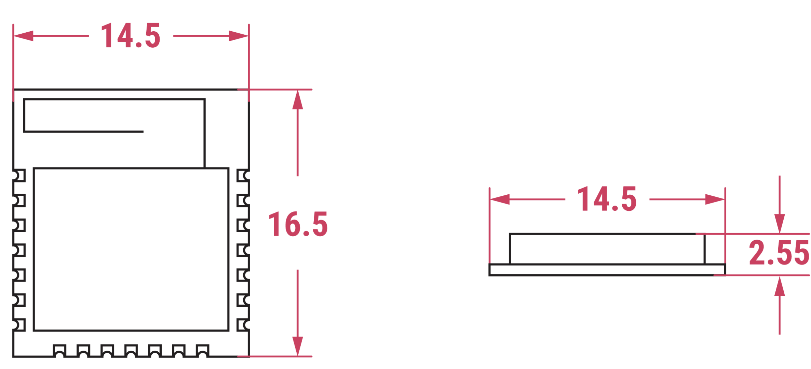

This page covers RM2 only.

[[features]]
== RM2 key features

.Raspberry Pi Radio Module 2 (RM2)
image::images/RM2.png[width="50%"]

RM2 is a compact, self-contained Wi-Fi and Bluetooth radio module, delivering reliable *2.4 GHz Wi-Fi (802.11b/g/n)* and *Bluetooth 5.2* connectivity. Specifically, RM2 offers the following key features:

* *Wi-Fi support.* Wi-Fi 4 (802.11b/g/n), single band (2.4 GHz).
* *Bluetooth 5.2 support.* Bluetooth Classic and Bluetooth Low Energy (BLE).
* *Compact form factor.* Uses the *Infineon CYW43439* combo chip in a 1 x 1 single-board configuration.
* *Secure soldering.* Castellated pins for versatile mounting.
* *Compatibility.* Full software compatibility with Pico W and Pico 2 W SDK.
* *Simple GPIO expander.* Three host-controlled GPIOs for added I/O capabilities.
* *Modular wireless certification (region-specific).* Simplifies compliance with regulatory requirements. For more information, see <<compliance>>.
* *Minimal I/O overhead.* Low-pin-count gSPI host interface allows for simplified integration with minimal I/O requirements.
* *Efficient single-antenna design:*
    ** SISO (Single Input, Single Output) configuration supports efficient single-antenna wireless performance.
    ** Shared 2.4 GHz antenna for Wi-Fi and Bluetooth.
* *Connectivity.* Integrated internal PA and LNA for signal range and reliability.
Speed. Support 20 MHz channels with data rates up to 96 Mbps (PHY rate).
* *Wide operating temperature range.* –30°C to +70°C.
* *Low power consumption:*
    ** IEEE Power Save (PM1 DTIM1 average rate 1): 1.19 mA
    ** Receive active rate MCS7 (at -50 dBm): 43 mA
    ** Transmit active rate MCS7 (at 16 dBm): 271 mA

== Technical specifications

The mechanical diagram illustrates the approximate shape and dimensions of RM2.

RM2 is approximately 14.5 x 16.5 mm with an approximate thickness of 2.55 mm. RM2's PCB is made from flame retardant FR4 material and features 21 edge-plated castellated pins for secure soldering to other boards. The module uses of 1.5 mm pitch gold-plated contacts for reliable electrical connectivity.

.Mechanical diagram of Raspberry Pi Radio Module 2 (RM2) from the top and side; dimensions are in millimetres (mm) and are approximate

[[compliance]]
== Compliance
RM2 is designed to comply with international radio regulations, offering pre-certified approval in key global markets. RM2 is fully tested and tuned by Raspberry Pi, meaning that its design doesn't require further RF tuning or module programming on your production line. You can access relevant product test reports, certifications, and integration test software through our https://pip.raspberrypi.com/[Product Information Portal (PIP)].

RM2 comes with full modular approval in the following regions:

* European Union (EU)
* United Kingdom (UK)
* United States of America (USA)
* Canada

Modular approval means that you don't have to conduct full radio certification in these regions; you can integrate RM2 into your product with minimal additional testing.

If you need support with module integration or if you plan to use RM2 in regions beyond those listed above, contact the Global Market Access team at gma@raspberrypi.com.

